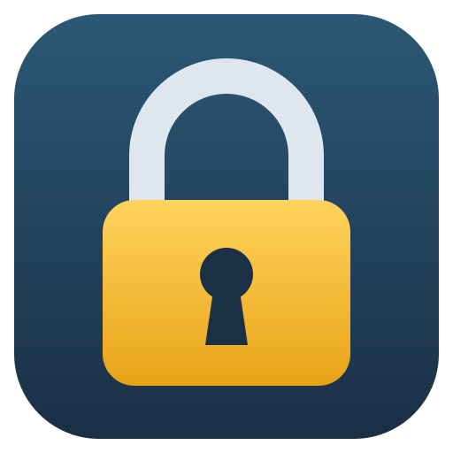
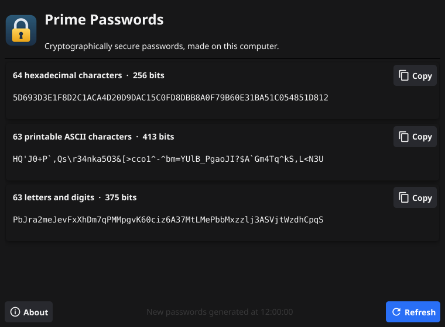
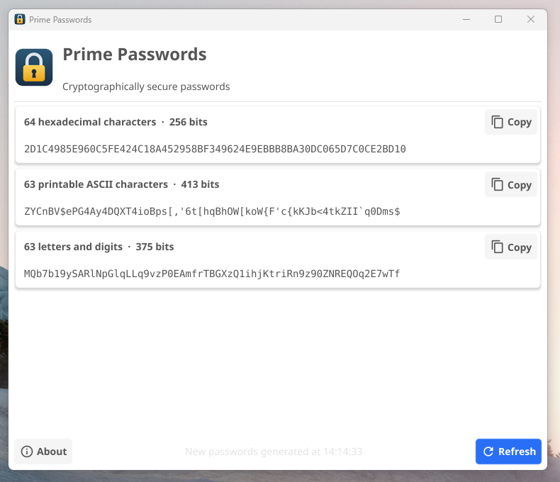
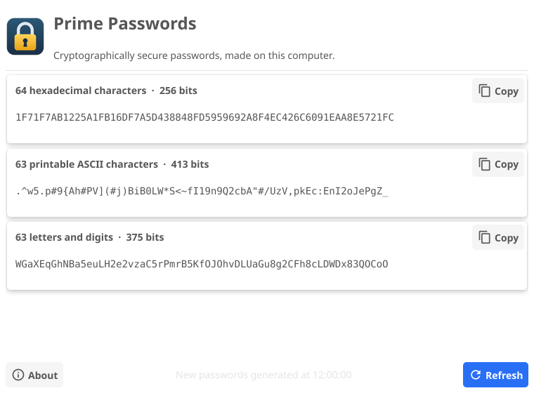
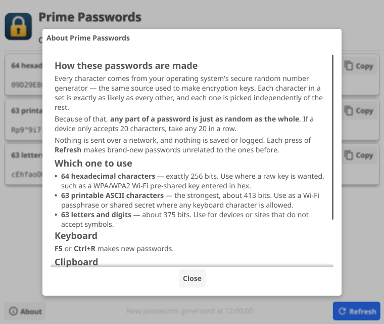

<p align="center">
  
</p>

<h1 align="center">Prime Passwords</h1>

<p align="center">
  <b>Strong, truly random passwords — made on your own computer, never on someone else's server.</b><br>
  Free and open source · Windows and Linux · No install needed on Windows · No account, no internet, no tracking
</p>

<p align="center">
  
</p>

---

## Contents

- [Why Prime Passwords?](#why-prime-passwords)
- [What you get](#what-you-get)
- [Download](#download)
- [Windows](#windows)
- [Linux](#linux)
- [How to use it](#how-to-use-it)
- [What to expect](#what-to-expect)
- [Which password should I use?](#which-password-should-i-use)
- [Security and privacy](#security-and-privacy)
- [Checking your download](#checking-your-download)
- [Troubleshooting](#troubleshooting)
- [Frequently asked questions](#frequently-asked-questions)
- [Building from source](#building-from-source)
- [Credits and license](#credits-and-license)

---

## Why Prime Passwords?

Most "password generator" websites make your password on *their* server and
send it to you over the internet. You have to trust that server, the
connection, and everyone who runs it. Prime Passwords does the same job
entirely on your own computer.

- **🔒 Nothing leaves your computer.** The program contains no code that
  talks to the internet. You can unplug your network cable and it works
  exactly the same.
- **🎲 Real randomness.** Every character comes from your operating system's
  cryptographic random number generator — the same source used to create
  encryption keys. It is not a "shuffle" or a pattern.
- **⚖️ Perfectly even odds.** Every character in a set is exactly as likely as
  every other. Many generators get this subtly wrong; Prime Passwords is
  tested for it every build.
- **🧾 Nothing is saved.** No history, no log files, no settings containing
  passwords. Close the window and they are gone.
- **📋 Clipboard clean-up.** Copy a password and Prime Passwords wipes it from
  the clipboard 30 seconds later — unless you have copied something else
  since, which it leaves alone.
- **💪 Extremely strong.** Each password is between 256 and 413 bits strong.
  For comparison, a typical "strong" 12-character password is about 79 bits.
- **🪶 Simple.** One window, three passwords, a **Refresh** button. No
  account, no ads, no subscription, no settings to get wrong.
- **🔍 Open and checked.** All source code is here to read. Every build is
  checked for known vulnerabilities and security problems (see
  [SECURITY.md](SECURITY.md)).
- **🆓 Free forever.** MIT license.

Prime Passwords was inspired by Steve Gibson's well-known
[Perfect Passwords](https://www.grc.com/passwords.htm) page at GRC.com, and
gives you the same three kinds of password — but made locally, on demand,
in a desktop app.

## What you get

Every time you open Prime Passwords, or press **Refresh**, you get three
brand-new passwords:

| Password | Example characters | Strength | Best for |
|---|---|---|---|
| **64 hexadecimal characters** | `0-9 A-F` | 256 bits | Wi-Fi (WPA/WPA2) keys entered in hex, encryption keys |
| **63 printable ASCII characters** | letters, digits and symbols like `! # % & * @ ~` | ~413 bits | Wi-Fi passphrases, shared secrets, anything that allows symbols |
| **63 letters and digits** | `a-z A-Z 0-9` | ~375 bits | Devices, routers and websites that reject symbols |

## Download

Go to the **[latest release](https://github.com/rclinux/prime-passwords/releases/latest)**
and download the one file for your computer:

| Your computer | File to download | What to do with it |
|---|---|---|
| **Windows 10 or 11** (64-bit) | `prime-passwords-<version>-windows-amd64.exe` | Double-click it. That's it. |
| **Linux** (64-bit) | `prime-passwords-<version>-linux-amd64.tar.gz` | Extract it and run `./install.sh` |

`<version>` is the version number, for example `0.1.0`. You do **not** need
to download the "Source code" files unless you want to build it yourself.

`SHA256SUMS` is optional: it lets you
[check your download](#checking-your-download) is exactly what was published.

---

## Windows

<p align="center">
  
</p>

### What you need

- Windows 10 or Windows 11, 64-bit (almost every PC from the last decade).
- Nothing else. No installer, no .NET, no runtime, no admin rights.

### Getting it

1. Open the **[latest release](https://github.com/rclinux/prime-passwords/releases/latest)**.
2. Under **Assets**, click `prime-passwords-<version>-windows-amd64.exe`.
3. Your browser may say the file "isn't commonly downloaded". Choose
   **Keep** (in Edge: click **…** next to the download, then **Keep**).

### First run — the blue "Windows protected your PC" box

> **If a blue "Windows protected your PC" box appears, click More info, then
> Run anyway. That warning is expected, because the program isn't
> code-signed.**

Why this happens: Windows shows this box for any program that has not been
signed with a paid code-signing certificate and is not yet widely
downloaded. It does **not** mean a problem was found. You only see it the
first time; after that, Prime Passwords opens straight away. If you would
like extra peace of mind first, [check your download](#checking-your-download)
against the published checksum.

### Everyday use on Windows

- Double-click the `.exe` whenever you need a password.
- Want it handy? Move the `.exe` somewhere permanent (for example
  `Documents` or `C:\Tools`), then right-click it → **Show more options** →
  **Pin to Start** or **Send to → Desktop (create shortcut)**.
- **Uninstalling:** delete the `.exe`. Nothing else was installed and nothing
  was written to the registry.

---

## Linux

<p align="center">
  
</p>

### What you need

- A 64-bit Linux desktop with glibc 2.35 or newer, for example:
  Ubuntu 22.04+, Linux Mint 21+, Debian 12+, Fedora 36+, Pop!_OS 22.04+,
  Arch, Manjaro, EndeavourOS, Omarchy, openSUSE Tumbleweed.
- Works on both **Wayland** and **X11** desktops (GNOME, KDE Plasma, COSMIC,
  Cinnamon, Xfce, Hyprland and others).
- No root/sudo needed. Nothing else to install.

### Install

```sh
# 1. Download prime-passwords-<version>-linux-amd64.tar.gz from the latest release, then:
tar -xzf prime-passwords-*-linux-amd64.tar.gz
cd prime-passwords-*-linux-amd64

# 2. Install for your user (adds the app and its padlock icon to your app menu)
./install.sh
```

Now open **Prime Passwords** from your application menu or launcher, just
like any other app.

`install.sh` puts three things in your home folder and nowhere else:

| File | Where |
|---|---|
| The program | `~/.local/bin/prime-passwords` |
| App menu entry | `~/.local/share/applications/prime-passwords.desktop` |
| Icon | `~/.local/share/icons/hicolor/…/prime-passwords.png` |

### Update

Download the new release and run its `./install.sh`. It replaces the old
version.

### Uninstall

```sh
./install.sh --uninstall
```

### Use it from the terminal

The same program also works in a terminal, which is handy for scripts:

```sh
prime-passwords --cli     # all three passwords, labelled
prime-passwords --hex     # just the 64 hex characters
prime-passwords --ascii   # just the 63 printable ASCII characters
prime-passwords --alnum   # just the 63 letters and digits
prime-passwords --version
```

(These work on Windows too, from Command Prompt or PowerShell.)

---

## How to use it

<p align="center">
  
</p>

| To… | Do this |
|---|---|
| Get new passwords | Click **Refresh**, or press **F5** or **Ctrl+R** |
| Copy a password | Click the **Copy** button next to it, then paste where you need it |
| Copy only part of one | Select the characters with your mouse and copy them |
| Read how it works | Click **About** |

**Need a shorter password?** Any part of a Prime Passwords password is just
as random as the whole thing. If a router only accepts 20 characters, use
any 20 characters in a row.

## What to expect

- The window opens with three new passwords already made.
- Every **Refresh** replaces all three with completely new, unrelated ones.
  There is no way to get an old one back — by design.
- After **Copy**, the status line says the clipboard will be cleared in 30
  seconds, then "Clipboard cleared".
- The window follows your system's light or dark theme.
- No settings, no first-run questions, no internet access, no updates
  running in the background.

## Which password should I use?

- **Home Wi-Fi (WPA2/WPA3):** the **63 printable ASCII** password gives the
  maximum strength a Wi-Fi passphrase allows. If your router or a device
  struggles with symbols, use **63 letters and digits** instead.
- **Router or device that asks for a "hex key" or "PSK in hex":** the
  **64 hexadecimal** password.
- **VPN shared secrets, API keys, encryption keys:** **63 printable ASCII**,
  or **64 hex** where hex is required.
- **Website passwords:** any of them, cut to the site's maximum length —
  and ideally stored in a password manager.

## Security and privacy

In short:

- Passwords come from the operating system's cryptographic random generator
  (Go's `crypto/rand`), with equal odds for every character.
- No network code, no files written, no logging, no telemetry.
- The clipboard is cleared 30 seconds after a copy.
- On Linux the program also blocks crash dumps and other programs from
  reading its memory.
- Every build runs vulnerability and security scans (`make audit`).

The full details — including what Prime Passwords **cannot** protect you
from, such as clipboard-history tools or a computer that already has
malware — are in **[SECURITY.md](SECURITY.md)**.

## Checking your download

Each release includes `SHA256SUMS`, a list of fingerprints for the download
files. If your file's fingerprint matches, it is exactly the file that was
published.

**Windows (PowerShell):**

```powershell
Get-FileHash .\prime-passwords-*-windows-amd64.exe -Algorithm SHA256
```

**Linux:**

```sh
sha256sum -c SHA256SUMS --ignore-missing
```

Compare the result with the matching line in `SHA256SUMS`.

## Troubleshooting

| Problem | Fix |
|---|---|
| Windows: blue "Windows protected your PC" box | Expected for unsigned programs. Click **More info**, then **Run anyway**. See [First run](#first-run--the-blue-windows-protected-your-pc-box). |
| Windows: browser says the file "isn't commonly downloaded" | Choose **Keep**. Same reason as above. |
| Windows: window doesn't open in a virtual machine | The app needs OpenGL graphics. Enable 3D acceleration in the VM settings. |
| Linux: `version 'GLIBC_2.xx' not found` | Your distribution is older than those listed above. [Build from source](#building-from-source) instead. |
| Linux: not in the app menu after installing | Log out and back in, or run it directly: `~/.local/bin/prime-passwords` |
| Linux: `prime-passwords: command not found` in a terminal | `~/.local/bin` isn't on your PATH. Use the full path, or add it to your PATH. |

## Frequently asked questions

**Is it really random?** Yes. It uses the same random source your operating
system uses for encryption keys, and the test suite checks that every
character appears with equal frequency.

**Could two people get the same password?** In practice, no. There are about
10<sup>124</sup> possible 63-character printable passwords — vastly more than
the number of atoms in the Earth.

**Does it remember my passwords?** No. It is a generator, not a password
manager. Store the passwords you use in a password manager.

**Does it need the internet?** No. It never connects to anything.

**Why is the Windows program "unsigned"?** Code-signing certificates cost
money every year. Signing doesn't change what the program does; it only
changes the warning Windows shows. The full source code is here for anyone
to inspect or build themselves.

**Is it affiliated with GRC or Steve Gibson?** No. It was inspired by GRC's
Perfect Passwords page, but it is a separate, independent project.

## Building from source

You need Go 1.26 or newer, a C compiler and the OpenGL/X11/Wayland
development libraries.

| Distribution | Install build tools |
|---|---|
| Arch / Omarchy / Manjaro | `sudo pacman -S go gcc` |
| Ubuntu / Debian / Mint | `sudo apt install golang gcc libgl1-mesa-dev xorg-dev libwayland-dev libxkbcommon-dev` (Go from [go.dev](https://go.dev/dl/) if your distribution's is older than 1.26) |
| Fedora | `sudo dnf install golang gcc libX11-devel libXcursor-devel libXrandr-devel libXinerama-devel libXi-devel libXxf86vm-devel mesa-libGL-devel wayland-devel libxkbcommon-devel` |

```sh
git clone https://github.com/rclinux/prime-passwords
cd prime-passwords
make test          # run the tests
make install       # build and install for your user (~/.local), with app menu icon
make uninstall     # remove it again
```

Other targets:

| Command | What it does |
|---|---|
| `make build` | Build `./prime-passwords` (runs on X11 and Wayland; add `TAGS=wayland` for a native Wayland window) |
| `make linux-release` | Build the Linux download (`dist/*.tar.gz`) |
| `make windows` | Cross-compile the Windows `.exe` from Linux (needs `mingw-w64-gcc` and `go install fyne.io/tools/cmd/fyne@latest`) |
| `make audit` | Checksums, `go vet`, staticcheck, gosec, govulncheck and race-detector tests |

Release downloads are built automatically by GitHub Actions
(`.github/workflows/release.yml`) when a version tag is pushed.

## Credits and license

- Inspired by Steve Gibson's [Perfect Passwords](https://www.grc.com/passwords.htm)
  page at GRC.com. Prime Passwords is an independent project, not affiliated
  with GRC.
- Built with [Go](https://go.dev) and the [Fyne](https://fyne.io) toolkit.
- Released under the [MIT License](LICENSE) — free to use, share and modify.

See [CHANGELOG.md](CHANGELOG.md) for what changed in each version.
